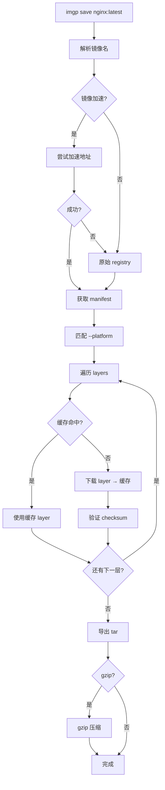
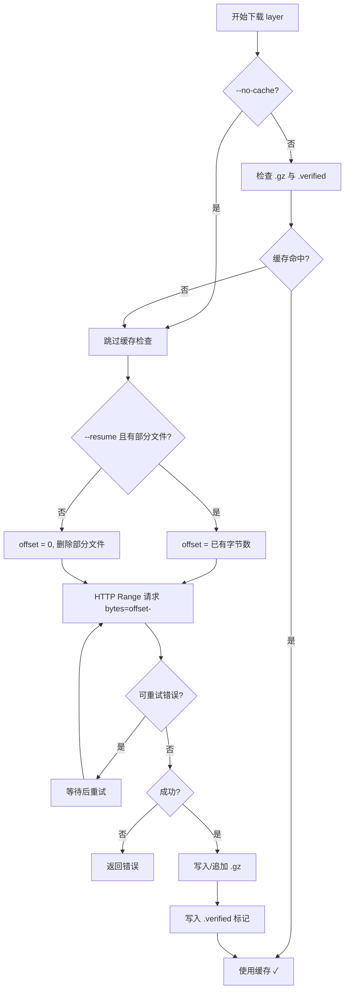
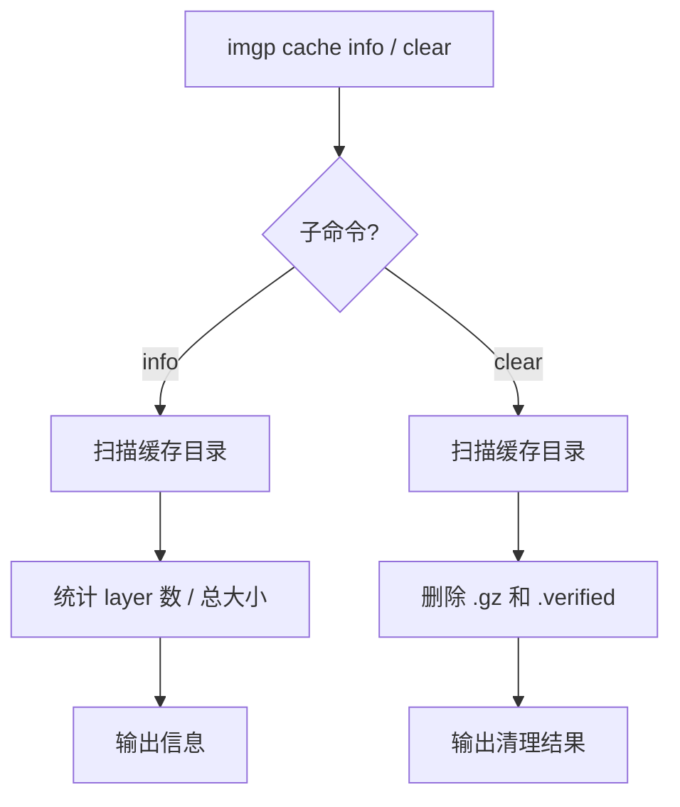
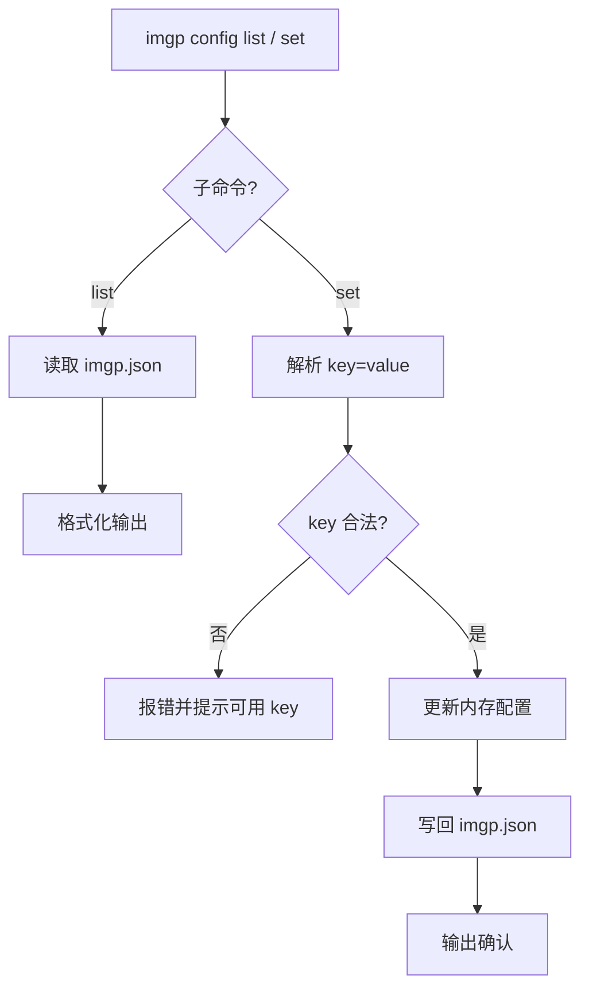

[English](README_EN.md) | 中文

# imgp

Windows Docker 镜像拉取导出工具。纯 Go 单文件，无需 Docker 守护进程。

```
imgp save hello-world:latest -o hello-world.tar
docker load -i hello-world.tar
```

从 [Releases](https://gitcode.com/DonaldTom/imgp/releases) 下载 `imgp-windows-amd64.exe` 放入 `PATH` 即可，或 `go install gitcode.com/DonaldTom/imgp@latest`。

---

## 快速开始

```bash
# 拉取并导出
imgp save hello-world:latest

# 指定平台
imgp save nginx:latest --platform linux/arm64 -o nginx-arm64.tar

# 私有仓库
export IMG_REGISTRY_PASSWORD=your_password
imgp save private.registry.com/myapp:latest --username user

# 多个镜像（自动命名）
imgp save nginx:latest redis:latest alpine:latest

# gzip 压缩
imgp save nginx:latest -z -o nginx.tar.gz
```

---

## 架构

### 1. imgp save 主流程



### 2. 缓存与断点续传逻辑



### 3. cache 子命令



### 4. config 子命令



---

## 命令参考

### `imgp save [镜像名...]`

| 参数 | 类型 | 默认值 | 说明 |
|---|---|---|---|
| `-o, --output` | string | `镜像名_平台.tar` | 输出路径。多镜像时不可用 |
| `-p, --platform` | string | `linux/amd64` | 目标平台 |
| `--username` | string | — | Registry 登录用户名 |
| `--password` | string | — | 密码（建议用 `--password-env`） |
| `--password-env` | string | — | 存放密码的环境变量名 |
| `--insecure` | bool | `false` | 跳过 TLS 验证 |
| `-P, --parallel` | int | `4` | 并行下载数 |
| `--no-cache` | bool | `false` | 忽略缓存 |
| `--resume` | bool | `false` | 断点续传（HTTP Range 请求续传中断的 layer） |
| `-z, --gzip` | bool | `false` | gzip 压缩输出 |
| `--cache-dir` | string | OS 默认 | 缓存目录 |
| `--timeout` | int | `0`(不限) | 整体超时（分钟） |
| `--layer-timeout` | int | `30` | 每层超时（分钟） |
| `--retry` | int | `2` | 重试次数（`0`=不重试） |
| `-q, --quiet` | bool | `false` | 只输出路径 |

### 缓存管理

```bash
imgp cache info            # 查看缓存
imgp cache clear           # 清空缓存
```

默认路径：Windows `%LOCALAPPDATA%\imgp\cache`，Linux `~/.cache/imgp`，macOS `~/Library/Caches/imgp`。

### 配置管理

`imgp config set <key> <value>`，配置文件 `imgp.json` 在二进制同目录：

```json
{
  "mirror_map": {"docker.io": ["docker.m.daocloud.io"]},
  "auths": {"registry.example.com": {"username": "user", "password_env": "IMG_REGISTRY_PASSWORD"}},
  "parallelism": 4, "retry": 2, "layer_timeout": 30, "timeout": 0, "cache_dir": ""
}
```

可用配置项：`mirror-map`、`parallelism`、`retry`、`cache-dir`、`insecure-registries`、`layer-timeout`、`timeout`。

---

## 镜像加速

内置国内加速镜像，拉取时自动尝试，失败回退原始地址：

| 原始 Registry | 加速地址 | 提供方 |
|---|---|---|
| `docker.io` | `docker.m.daocloud.io` | DaoCloud |
| `gcr.io` | `gcr.mirrors.daocloud.io` | DaoCloud |
| `registry.k8s.io` | `m.daocloud.io/registry.k8s.io` | DaoCloud |
| `quay.io` | `quay.nju.edu.cn` | 南京大学 |

自定义：`imgp config set mirror-map "docker.io=my-mirror.com"`（`|` 分隔多个，按顺序尝试）。

> 镜像地址不加 `https://`；digest 引用暂不支持加速。

---

## 常见问题

### 和 docker pull + docker save 有什么区别？

`docker pull` 需要 Docker 守护进程（Windows 上需 WSL2/Hyper-V）。imgp 是单文件二进制，零依赖。

### 中断了怎么办？

已完整下载的 layer 自动缓存，重跑即复用。`--no-cache` 强制重下。404/401/403 等错误不会重试。

未完成的 layer 默认重下；加 `--resume` 可基于已下载部分通过 HTTP Range 请求断点续传：

```bash
imgp save large-image:latest --resume -o large.tar
```

### 支持哪些平台？

格式 `os/arch`：`linux/amd64`（默认）、`linux/arm64`、`linux/arm64/v8`、`windows/amd64`、`windows/arm64`、`darwin/amd64`、`darwin/arm64`。

### Docker Hub 访问不了？

默认已配国内加速（见上表）。自定义镜像站：`imgp config set mirror-map "docker.io=你的镜像地址"`。

---

## License

GNU General Public License v3.0。详见 [LICENSE](LICENSE)。
