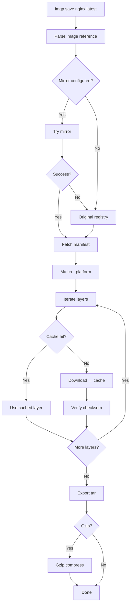
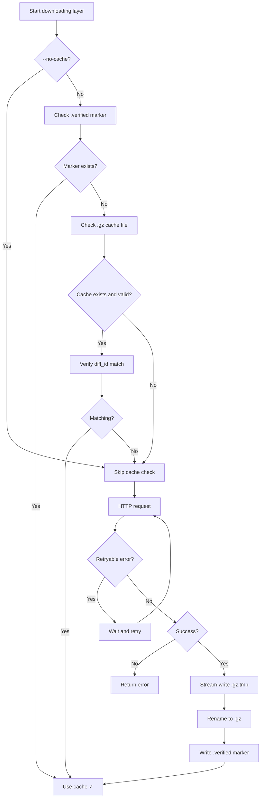
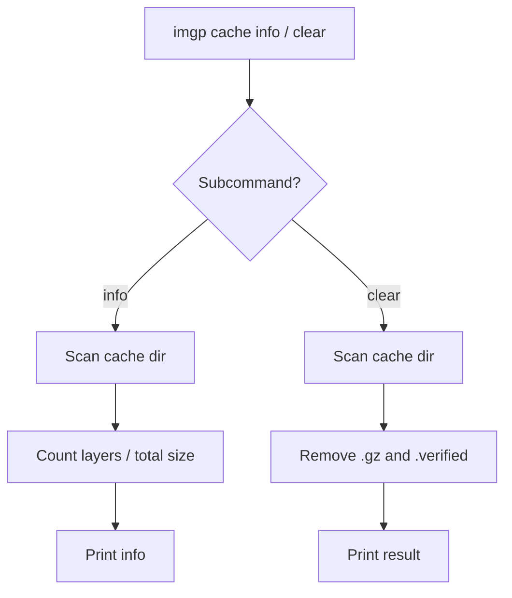
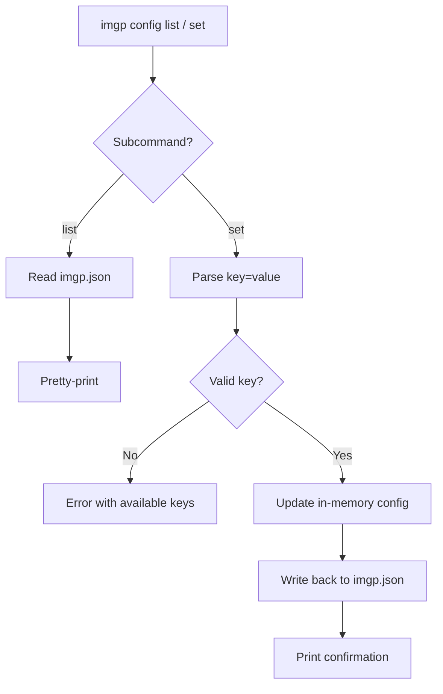

English | [中文](README.md)

# imgp

A Docker image pull and save tool for Windows. Single binary, zero dependencies, no Docker daemon required.

```
imgp save hello-world:latest -o hello-world.tar
docker load -i hello-world.tar
```

Download `imgp-windows-amd64.exe` from [Releases](https://gitcode.com/DonaldTom/imgp/releases) and put it in your `PATH`, or `go install gitcode.com/DonaldTom/imgp@latest`.

---

## Quick Start

```bash
# Pull and save
imgp save hello-world:latest

# Specify platform
imgp save nginx:latest --platform linux/arm64 -o nginx-arm64.tar

# Private registry
export IMG_REGISTRY_PASSWORD=your_password
imgp save private.registry.com/myapp:latest --username user

# Multiple images (auto-named)
imgp save nginx:latest redis:latest alpine:latest

# Gzip compression
imgp save nginx:latest -z -o nginx.tar.gz
```

---

## Architecture

### 1. imgp save main flow



### 2. Cache resolution logic



### 3. cache subcommand



### 4. config subcommand



---

## Command Reference

### `imgp save [image...]`

| Flag | Type | Default | Description |
|---|---|---|---|
| `-o, --output` | string | `image_platform.tar` | Output path. Not allowed for multiple images |
| `-p, --platform` | string | `linux/amd64` | Target platform |
| `--username` | string | — | Registry username |
| `--password` | string | — | Password (use `--password-env` instead) |
| `--password-env` | string | — | Env var name holding the password |
| `--insecure` | bool | `false` | Skip TLS verify |
| `-P, --parallel` | int | `4` | Parallel downloads |
| `--no-cache` | bool | `false` | Ignore cache |
| `-z, --gzip` | bool | `false` | Gzip-compress output |
| `--cache-dir` | string | OS default | Cache directory |
| `--timeout` | int | `0`(unlimited) | Overall timeout (minutes) |
| `--layer-timeout` | int | `30` | Per-layer timeout (minutes) |
| `--retry` | int | `2` | Retry count (`0`=no retry) |
| `-q, --quiet` | bool | `false` | Output path only |

### Cache

```bash
imgp cache info            # show cache usage
imgp cache clear           # remove all cached layers
```

Default: Windows `%LOCALAPPDATA%\imgp\cache`, Linux `~/.cache/imgp`, macOS `~/Library/Caches/imgp`.

### Config

`imgp config set <key> <value>`, config file `imgp.json` alongside the binary:

```json
{
  "mirror_map": {"docker.io": ["docker.m.daocloud.io"]},
  "auths": {"registry.example.com": {"username": "user", "password_env": "IMG_REGISTRY_PASSWORD"}},
  "parallelism": 4, "retry": 2, "layer_timeout": 30, "timeout": 0, "cache_dir": ""
}
```

Keys: `mirror-map`, `parallelism`, `retry`, `cache-dir`, `insecure-registries`, `layer-timeout`, `timeout`.

---

## Mirror Acceleration

Default mirrors for fast access in China (tried first, fall back to original on failure):

| Registry | Mirror | Provider |
|---|---|---|
| `docker.io` | `docker.m.daocloud.io` | DaoCloud |
| `gcr.io` | `gcr.mirrors.daocloud.io` | DaoCloud |
| `registry.k8s.io` | `m.daocloud.io/registry.k8s.io` | DaoCloud |
| `quay.io` | `quay.nju.edu.cn` | Nanjing University |

Custom: `imgp config set mirror-map "docker.io=my-mirror.com"` (separate multiple with `|`, tried in order).

> Don't include `https://` in mirror addresses; digest references don't use mirrors.

---

## FAQ

### How is this different from docker pull + docker save?

`docker pull` needs the Docker daemon (requires WSL2/Hyper-V on Windows). imgp is a single binary with zero dependencies.

### Download interrupted?

Cached layers resume automatically. Re-run the same command. `--no-cache` forces re-download. 4xx errors are NOT retried.

### What platforms are supported?

Format `os/arch`: `linux/amd64` (default), `linux/arm64`, `linux/arm64/v8`, `windows/amd64`, `windows/arm64`, `darwin/amd64`, `darwin/arm64`.

### Can't access Docker Hub?

Default mirrors are pre-configured (see table above). Custom: `imgp config set mirror-map "docker.io=your-mirror.com"`.

---

## License

GNU General Public License v3.0. See [LICENSE](LICENSE).
